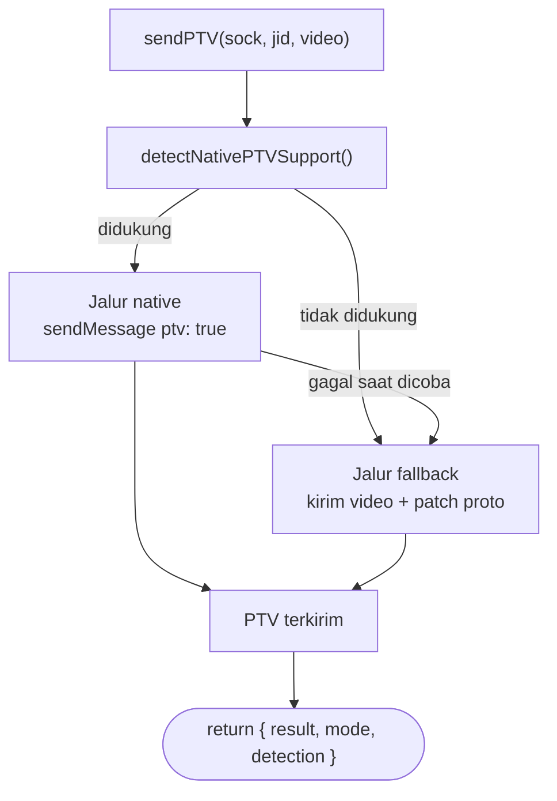

<div align="center">

# nano-payload

**Universal PTV (Video Note) payload builder untuk WhatsApp bot berbasis Baileys**

Auto-detect dukungan native `ptv: true` → fallback ke raw proto kalau tidak tersedia.

[](https://www.npmjs.com/package/nano-payload)
[](https://www.npmjs.com/package/nano-payload)
[](./LICENSE)
[](https://nodejs.org)
[](https://github.com/reinhald90/nano-payload-v1.0.0/pulls)

</div>

---

## Kenapa nano-payload?

Banyak fork/versi [Baileys](https://github.com/WhiskeySockets/Baileys) yang belum, atau tidak konsisten, mendukung opsi `ptv: true` pada `sendMessage`. Setiap kali ganti versi library, kode bot harus disesuaikan lagi.

`nano-payload` jadi lapisan kompatibilitas: cek dulu apakah socket kamu mendukung PTV secara native, kalau tidak, otomatis fallback ke pengiriman video biasa lalu menandai proto `videoMessage` sebagai PTV secara manual.

## Alur kerja



## Instalasi

```bash
npm install nano-payload
```

> Package ini butuh `@whiskeysockets/baileys` (atau fork sejenis) sudah terpasang di project kamu sebagai peer — nano-payload tidak membawa baileys sendiri.

## Pemakaian dasar

```js
import { sendPTV } from 'nano-payload'

const { result, mode } = await sendPTV(sock, jid, '/path/ke/video.mp4', {
    caption: 'Halo dari nano-payload!'
})

console.log('Terkirim lewat mode:', mode) // 'native' atau 'fallback'
```

Atau dengan Buffer langsung:

```js
import fs from 'fs'
import { sendPTV } from 'nano-payload'

const buffer = fs.readFileSync('./video.mp4')
await sendPTV(sock, jid, buffer)
```

## Opsi

| Opsi | Tipe | Keterangan |
|---|---|---|
| `caption` | `string` | Caption opsional untuk video |
| `seconds` | `number` | Durasi video (dipakai jalur native) |
| `messageOptions` | `object` | Diteruskan langsung ke `sock.sendMessage` (mis. `{ quoted }`) |
| `patchContent` | `function` | Callback `(baseMessage, sock, jid) => {}` untuk menyesuaikan proto pada jalur fallback — berguna untuk fork dengan struktur berbeda |
| `forceFallback` | `boolean` | Paksa pakai jalur fallback walau native terdeteksi didukung |

## Cek dukungan native secara manual

```js
import { detectNativePTVSupport } from 'nano-payload'

const info = detectNativePTVSupport(sock)
console.log(info)
// { supported: true, reason: '...', pkg: { name: '@whiskeysockets/baileys', version: '6.7.x' } }
```

`detectNativePTVSupport` mengembalikan:

| Field | Tipe | Keterangan |
|---|---|---|
| `supported` | `boolean` | Apakah jalur native kemungkinan didukung |
| `reason` | `string` | Alasan singkat di balik keputusan tersebut |
| `pkg` | `object \| null` | Nama & versi paket baileys yang terdeteksi |

## Cara kerja singkat

1. **Deteksi** — cek versi baileys yang terpasang (lewat `package.json`-nya) dan apakah kemungkinan mendukung opsi native `ptv`.
2. **Native** — kalau didukung, kirim langsung pakai `sendMessage({ ptv: true })`.
3. **Fallback** — kalau tidak didukung, atau jalur native gagal saat dicoba, kirim video biasa (supaya proses upload & enkripsi media tetap ditangani library secara resmi), lalu tandai `videoMessage.ptv = true` pada proto dan relay ulang.

## Batasan

- Ini adalah lapisan kompatibilitas, **bukan** cara memaksa WhatsApp menerima PTV di tempat yang secara resmi tidak didukung.
- Jalur fallback tetap bergantung pada fungsi upload media generik dari library (`sock.sendMessage` / `sock.waUploadToServer`). Kalau library benar-benar tidak menyediakan itu, tidak ada yang bisa dilakukan dari sisi nano-payload.
- Perilaku bisa sedikit berbeda antar fork baileys karena struktur proto yang tidak selalu identik — gunakan `patchContent` untuk menyesuaikan kalau perlu.
- Flag `ptv` pada jalur fallback adalah usaha terbaik (best-effort) — kalau klien penerima memang belum punya jalur render PTV, video tetap tampil sebagai video biasa.

## Kontribusi

Pull request dan issue terbuka untuk siapa saja. Kalau menemukan fork baileys dengan struktur proto berbeda, laporkan lewat issue supaya bisa ditambahkan dukungannya.

---

<div align="center">

Dibuat oleh **Azure Ashiro** untuk komunitas **Lycount**

MIT License

</div>
